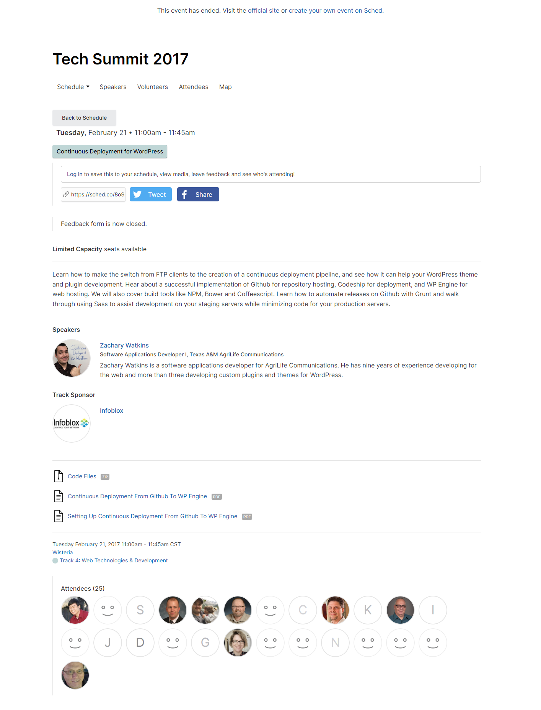

# Continuous Deployment from GitHub to WPEngine

[[toc]]

_This presentation was originally given on Tuesday, February 21, 2017 from 11:00am to 11:45am CST at the Texas A&M University System's annual Tech Summit conference in Galveston, Texas._

---

Learn how to make the switch from FTP clients to the creation of a continuous deployment pipeline, and see how it can help your WordPress theme and plugin development. Hear about a successful implementation of Github for repository hosting, Codeship for deployment, and WP Engine for web hosting. We will also cover build tools like NPM, Bower and Coffeescript. Learn how to automate releases on Github with Grunt and walk through using Sass to assist development on your staging servers while minimizing code for your production servers.

## Slides

[2017-continuous-deployment-from-github-to-wpengine.pdf](../2017-continuous-deployment-from-github-to-wpengine.pdf)

<iframe src="../2017-continuous-deployment-from-github-to-wpengine.pdf" width="100%" height="600px">
  <p>This browser does not support PDFs. Please download the PDF to view it: <a href="../2017-continuous-deployment-from-github-to-wpengine.pdf">Download PDF</a>.</p>
</iframe>

## Conference Agenda

[Conference agenda page](https://techsummit2017.sched.com/event/8o9i/continuous-deployment-for-wordpress) (shown below).



## Code Samples

I've provided a set of files for facilitating this process, although it could definitely use some modernization and is specific to git push deployments to WPEngine from Codeship. At the time we used several build tools now considered outdated, but I've left them in place for reference.

### codeship-staging.bash

```bash
# Get around shallow update restriction
if [ -f ${HOME}/clone/.git/shallow ]; then git fetch --unshallow; fi
# Add User Data
git config --global user.name "codeship-agriflex3"
git config --global user.email "zachary.watkins@ag.tamu.edu"
# Add servers
git remote add servers $AGRILIFE_STAGING
git remote set-url --add --push servers $AGRILIFE_STAGING
git remote set-url --add --push servers $COALS_STAGING
git remote set-url --add --push servers $COUNTIES_STAGING
git remote set-url --add --push servers $AGRILIFEEXTENSION_STAGING
git remote set-url --add --push servers $TXMG_STAGING
git remote set-url --add --push servers $TXMN_STAGING
# Install needed modules
npm install -g grunt-cli
npm install -g grunt@0.4.0
npm install -g bower
npm install -g ruby
gem install compass
# Move repo files to a named folder
mkdir $FOLDERNAME
shopt -s extglob
mv !($FOLDERNAME) $FOLDERNAME
# Move repo files whose name begins with a period
mv .sass-lint.yml $FOLDERNAME/.sass-lint.yml
# Exclude development-only files from commit
rm .gitignore
mv .codeshipignore $FOLDERNAME/.gitignore
# Move named folder into a structure identical to the
# root directory of a WordPress server
mkdir -p $DIRECTORY
mv $FOLDERNAME $DIRECTORY
cd $DIRECTORY/$FOLDERNAME/
# Build
composer install
npm install
bower install html5shiv#3.7.0
bower install respond#1.4.1
grunt develop
# Deploy
git add --all :/
git commit -m "DEPLOYMENT"
git push servers HEAD:master --force
```

### codeship-production.bash

```bash
# Get around shallow update restriction
if [ -f ${HOME}/clone/.git/shallow ]; then git fetch --unshallow; fi
# Add User Data
git config --global user.name "codeship-agriflex3"
git config --global user.email "zachary.watkins@ag.tamu.edu"
# Add servers
git remote add servers $AGRILIFE_PRODUCTION
git remote set-url --add --push servers $AGRILIFE_PRODUCTION
git remote set-url --add --push servers $COALS_PRODUCTION
git remote set-url --add --push servers $COUNTIES_PRODUCTION
git remote set-url --add --push servers $AGRILIFEEXTENSION_PRODUCTION
git remote set-url --add --push servers $TXMG_PRODUCTION
git remote set-url --add --push servers $TXMN_PRODUCTION
# Install needed modules
npm install -g grunt-cli
npm install -g grunt@0.4.0
npm install -g bower
npm install -g ruby
gem install compass
# Move repo files to a named folder
mkdir $FOLDERNAME
shopt -s extglob
mv !($FOLDERNAME) $FOLDERNAME
# Move repo files whose name begins with a period
mv .sass-lint.yml $FOLDERNAME/.sass-lint.yml
# Exclude development-only files from commit
rm .gitignore
mv .codeshipignore $FOLDERNAME/.gitignore
# Move named folder into a structure identical to the root
# directory of a WordPress server
mkdir -p $DIRECTORY
mv $FOLDERNAME $DIRECTORY
cd $DIRECTORY/$FOLDERNAME/
# Build
composer install
npm install
bower install html5shiv#3.7.0
bower install respond#1.4.1
grunt package
# Release
grunt release
# Deploy
git add --all :/
git commit -m "DEPLOYMENT"
git push servers HEAD:master --force
```

### config.rb

We used compass to compile our Sass files. This is the config.rb file we used.

```ruby
# Require any additional compass plugins here.
add_import_path "bower_components/foundation/scss"

# Set this to the root of your project when deployed:
http_path = "/"
css_dir = "css"
sass_dir = "css/src"
images_dir = "img"
javascripts_dir = "js"
fonts_dir = "font"

# Can be :expanded, :nested, :compact or :compressed
output_style = :compressed

# Allows relative paths to be used
relative_assets = true

# To disable debugging comments that display the original location of your selectors. Uncomment:
# line_comments = false
# color_output = false


# If you prefer the indented syntax, you might want to regenerate this
# project again passing --syntax sass, or you can uncomment this:
# preferred_syntax = :sass
# and then run:
# sass-convert -R --from scss --to sass sass scss && rm -rf sass && mv scss sass
preferred_syntax = :scss

sass_options = {:debug_info => false}
```

### .sass-lint.yml

We used sass-lint to check our Sass files for errors and code style. This is the .sass-lint.yml file we used.

```yaml
# Linter Options
# https://github.com/sasstools/sass-lint/tree/master/docs/rules
options:
  # Don't merge default rules
  merge-default-rules: false
# File Options
files:
  include: 'css/src/**/*.s+(a|c)ss'
  ignore:
    - 'sass/vendor/**/*.*'
    - 'css/src/partials/_simpletabs.scss'
    - 'css/src/lib/_grid.scss'
# Rule Configuration
rules:
  brace-style:
    - 2
    - style: '1tbs'
    - allow-single-line: false
  no-color-keywords: 2
  no-duplicate-properties:
    - 2
    - exclude:
        - background
        - background-color
        - border
        - white-space
  no-mergeable-selectors: 2
  no-misspelled-properties:
    - 2
    - 'extra-properties':
        - 'ms-filter'
        - '*text-indent'
        - '*zoom'
  space-after-colon: true
  space-after-comma: true
  trailing-semicolon: true
  extends-before-mixins: 2
  no-warn: 1
  no-debug: 1
  no-important: 1
  hex-notation:
    - 2
    - style: uppercase
  indentation:
    - 1
    - size: tab
  quotes:
    - 1
    - style: double
  border-zero: 0
  empty-args: 0
  empty-line-between-blocks: 0
  final-newline: 1
  force-element-nesting: 0
  force-pseudo-nesting: 0
  hex-length: 1
  mixins-before-declarations: 0
  nesting-depth: 0
  no-color-literals: 0
  no-css-comments: 0
  no-empty-rulesets: 0
  no-ids: 0
  no-qualifying-elements: 0
  no-trailing-whitespace: 1
  no-vendor-prefixes: 0
  property-sort-order: 0
  single-line-per-selector: 0
  space-before-brace: 1
  zero-unit: 0
```

### .codeshipignore

We used this file to simplify the process of excluding development-only files from being uploaded to the server.

```.gitignore
# RECOMMENDED BY WPENGINE
*~
.DS_Store
.svn
.cvs
*.bak
*.swp
Thumbs.db

# large/disallowed file types
# a CDN should be used for these
*.hqx
*.bin
*.exe
*.dll
*.deb
*.dmg
*.iso
*.img
*.msi
*.msp
*.msm
*.mid
*.midi
*.kar
*.mp3
*.ogg
*.m4a
*.ra
*.3gpp
*.3gp
*.mp4
*.mpeg
*.mpg
*.mov
*.webm
*.flv
*.m4v
*.mng
*.asx
*.asf
*.wmv
*.avi

# Don't deploy
package.json
bower.json
.bower.json
.bowerrc
config.rb
node_modules
.sass-cache
*.md
*.txt
*.ai
*.scss
*.coffee
.gitignore
LICENSE
LICENSE-MIT
gruntfile.js
Gruntfile.js
werker.yml
.editorconfig
bower_components/**/foundation/scss/
bower_components/**/jquery/src/
bower_components/**/modernizr/*/
bower_components/**/modernizr/grunt.js
bower_components/**/picturefill/index.html
bower_components/**/picturefill/logos/*.png
bower_components/**/superfish/examples/
bower_components/html5shiv/
!bower_components/html5shiv/dist/html5shiv.js
css/src
js/src

# Prevent Composer files from being loaded if
# they are only used for PHP5.6+
# vendor/composer/autoload_static.php

# Ignore release file
AgriFlex3.zip
```

### package.json

This is the package.json file for the AgriFlex3 theme, which was used as an example repository for deployment to our network of WordPress websites.

```json
{
  "name": "AgriFlex3",
  "version": "1.2.6",
  "description": "Genesis child theme for Texas A&M AgriLife",
  "main": "functions.php",
  "dependencies": {
    "grunt": "~0.4.0"
  },
  "devDependencies": {
    "curlrequest": "~0.3.10",
    "grunt-contrib-compass": "~0.6.0",
    "grunt-contrib-compress": "~1.3.0",
    "grunt-contrib-watch": "~0.5.3",
    "grunt-gh-release": "0.0.2",
    "grunt-jsvalidate": "^0.2.2",
    "grunt-sass-lint": "~0.2.0",
    "underscore": "~1.8.3"
  },
  "engines": {
    "node": "4.0.0"
  },
  "repository": "https://github.com/agrilife/agriflex3",
  "author": "J. Aaron Eaton, Travis Ward, Zachary Watkins",
  "license": "GPL-2.0+",
  "readmeFilename": "README.md"
}
```

### Gruntfile.coffee

Yes, it's in CoffeeScript. It was in place when I started working on the project and I didn't want to change it.

```coffee
module.exports = (grunt) ->
  @initConfig
    pkg: @file.readJSON('package.json')
    watch:
      files: [
        'css/src/*.scss'
      ]
      tasks: ['develop']
    compass:
      pkg:
        options:
          config: 'config.rb'
          force: true
      dev:
        options:
          config: 'config.rb'
          force: true
          outputStyle: 'expanded'
          sourcemap: true
          noLineComments: true
    jsvalidate:
      options:
        globals:
          jQuery: true
          console: true
          module: true
          document: true
      targetName:
        files:
          src: [
            'js/*.js',
            'bower_components/foundation/js/vendor/fastclick.js',
            'bower_components/foundation/js/foundation/foundation?(.topbar).js',
            'bower_components/modernizr/modernizr.js',
            'bower_components/jquery/{dist,sizzle}/**/*.js',
            'bower_components/jquery-placeholder/*.js',
            'bower_components/jquery.cookie/jquery.cookie.js',
            'bower_components/respond/{cross-domain,dest}/*.js',
            'bower_components/html5shiv/dist/html5shiv.js'
          ]
    sasslint:
      options:
        configFile: '.sass-lint.yml'
      target: ['css/src/**/*.s+(a|c)ss']
    compress:
      main:
        options:
          archive: 'AgriFlex3.zip'
        files: [
          {src: ['AgriFlex/*.php']},
          {src: ['css/*.css']},
          {src: ['img/**']},
          {src: ['js/*.js']},
          {src: ['bower_components/fastclick/lib/fastclick.js']},
          {src: ['bower_components/foundation/{css,js}/**']},
          {src: ['bower_components/modernizr/modernizr.js']},
          {src: ['bower_components/jquery/{dist,sizzle}/**/*.js']},
          {src: ['bower_components/jquery-placeholder/*.js']},
          {src: ['bower_components/jquery.cookie/jquery.cookie.js']},
          {src: ['bower_components/respond/{cross-domain,dest}/*.js']},
          {src: ['bower_components/html5shiv/dist/html5shiv.js']},
          {src: ['vendor/**', '!vendor/composer/autoload_static.php']},
          {src: ['functions.php']},
          {src: ['README.md']},
          {src: ['rtl.css']},
          {src: ['screenshot.png']},
          {src: ['search.php']},
          {src: ['style.css']}
        ]
    gh_release:
      options:
        token: process.env.RELEASE_KEY
        owner: 'agrilife'
        repo: '<%= pkg.name %>'
      release:
        tag_name: '<%= pkg.version %>'
        target_commitish: 'master'
        name: 'Release'
        body: 'Release'
        draft: false
        prerelease: false
        asset:
          name: '<%= pkg.name %>.zip'
          file: '<%= pkg.name %>.zip'
          'Content-Type': 'application/zip'

  @loadNpmTasks 'grunt-contrib-compass'
  @loadNpmTasks 'grunt-jsvalidate'
  @loadNpmTasks 'grunt-contrib-watch'
  @loadNpmTasks 'grunt-contrib-compress'
  @loadNpmTasks 'grunt-gh-release'
  @loadNpmTasks 'grunt-sass-lint'

  @registerTask 'default', ['compass:pkg']
  @registerTask 'develop', ['sasslint', 'compass:dev', 'jsvalidate']
  @registerTask 'package', ['compass:pkg', 'jsvalidate']
  @registerTask 'release', ['compress', 'setreleasemsg', 'gh_release']
  @registerTask 'setreleasemsg', 'Set release message as range of commits', ->
    done = @async()
    grunt.util.spawn {
      cmd: 'git'
      args: [ 'tag' ]
    }, (err, result, code) ->
      if result.stdout isnt ''
        matches = result.stdout.match /([^\n]+)$/
        grunt.config.set 'lasttag', matches[1]
        grunt.task.run 'shortlog'
      done(err)
      return
    return
  @registerTask 'shortlog', 'Set gh_release body with commit messages since last release', ->
    done = @async()
    releaserange = grunt.template.process '<%= lasttag %>..HEAD'
    grunt.util.spawn {
      cmd: 'git'
      args: ['shortlog', releaserange, '--no-merges']
    }, (err, result, code) ->
      if result.stdout isnt ''
        message = result.stdout.replace /(\n)\s\s+/g, '$1- '
        message = message.replace /\s*\[skip ci\]/g, ''
        grunt.config 'gh_release.release.body', message
      done(err)
      return
    return

  @event.on 'watch', (action, filepath) =>
    @log.writeln('#{filepath} has #{action}')
```
