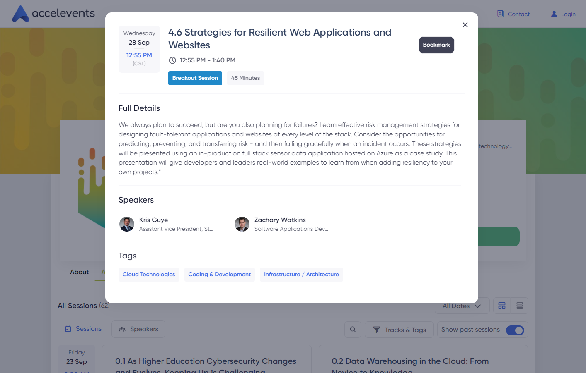

# Strategies for Resilient Web Applications and Websites

[[toc]]

_This presentation was originally given on Wednesday, September 28, 2022 from 12:55pm to 1:40pm CST at the Texas A&M University System's annual Tech Summit conference. Speaker introduction by Kris Guye._

---

We always plan to succeed, but are you also planning for failures? Learn effective risk management strategies for designing fault-tolerant applications and websites at every level of the stack. Consider the opportunities for predicting, preventing, and transferring risk - and then failing gracefully when an incident occurs. These strategies will be presented using an in-production full stack sensor data application hosted on Azure as a case study. This presentation will give developers and leaders real-world examples to learn from when adding resiliency to your own projects.

## Slides

[2022-strategies-for-resilient-web-applications-and-websites.pdf](/presentations/2022-strategies-for-resilient-web-applications-and-websites.pdf)

<iframe src="/presentations/2022-strategies-for-resilient-web-applications-and-websites.pdf" width="100%" height="600px">
  
This browser does not support PDFs. Please download the PDF to view it: <a href="/presentations/2022-strategies-for-resilient-web-applications-and-websites.pdf">Download PDF</a>.

</iframe>

## Conference Agenda

[Conference agenda page](https://www.accelevents.com/e/tech-summit-2022?sessionId=268761&pastSession=true#agenda) (shown below).

Tags:

- Cloud Technologies
- Coding & Development
- Infrastructure / Architecture
