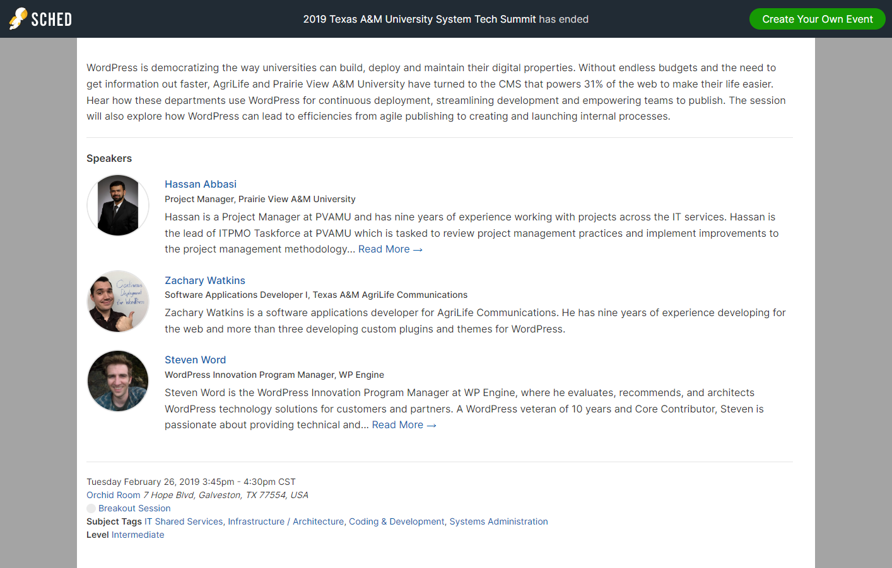

This presentation is a case study of how I build, deploy, and maintain WordPress websites at the Communications department of Texas A&M AgriLife. Slides from my portion of the presentation are available. It was originally presented to the Texas A&M University System on Tuesday, February 26, 2019 from 3:45pm to 4:30pm CST at the annual Tech Summit conference. It was co-presented by Zachary Watkins, Hassan Abbasi, and Steven Word.

---

[[toc]]

WordPress is democratizing the way universities can build, deploy and maintain their digital properties. Without endless budgets and the need to get information out faster, AgriLife and Prairie View A&M University have turned to the CMS that powers 31% of the web to make their life easier. Hear how these departments use WordPress for continuous deployment, streamlining development and empowering teams to publish. The session will also explore how WordPress can lead to efficiencies from agile publishing to creating and launching internal processes.

## Slides

I've provided my slides separate from those of the other presenters. You can download them here:

[2019-wp-higher-ed-wordpress.pdf](/presentations/2019-wp-higher-ed-wordpress.pdf)

<iframe src="/presentations/2019-wp-higher-ed-wordpress.pdf" width="100%" height="600px">
  
This browser does not support PDFs. Please download the PDF to view it: <a href="/presentations/2019-wp-higher-ed-wordpress.pdf">Download PDF</a>.

</iframe>

## Conference Agenda

[Conference agenda page](https://techsummit.sched.com/event/IRJ6/streamline-building-deploying-and-maintaining-your-higher-ed-websites-with-wordpress) (shown below).

Tags:

- IT Shared Services
- Infrastructure / Architecture
- Coding & Development
- Systems Administration
